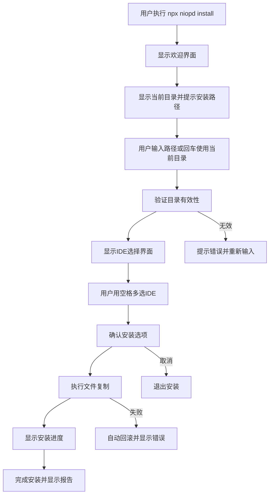

# NioPD CLI 安装系统设计文档

## 项目概述

NioPD CLI 是一个交互式命令行工具，用于将 NioPD 产品管理工具包安装到用户的开发环境中。该工具支持 Claude Code 和 iFlow CLI 两种 IDE 环境，提供友好的交互式安装体验。

## 核心功能

- **交互式安装向导**：引导用户完成安装过程
- **多 IDE 支持**：同时支持 Claude Code 和 iFlow CLI
- **灵活路径选择**：支持自定义安装目录
- **安全备份机制**：自动备份现有配置
- **回滚功能**：安装失败时自动回滚

## 用户体验流程

### 完整安装流程



### 交互界面设计

#### 1. 启动欢迎界面
```
╔══════════════════════════════════════╗
║         NioPD 安装向导               ║
║    AI驱动产品管理工具包              ║
║         版本 v1.0.0                  ║
╚══════════════════════════════════════╝

欢迎使用 NioPD CLI 安装工具！
这个向导将帮助您将 NioPD 安装到您的开发环境中。

按回车键继续...
```

#### 2. 目录选择界面
```
📁 步骤 1: 选择安装目录

当前工作目录: /Users/username/projects/my-project

请选择 NioPD 的安装目录：
> /Users/username/projects/my-project (当前目录)
  /Users/username/.claude (全局 Claude Code)
  /Users/username/.iflow (全局 iFlow CLI)
  自定义路径...

提示: 直接按回车使用当前目录
```

#### 3. IDE选择界面（多选）
```
🎯 步骤 2: 选择支持的 IDE

请选择要安装的 IDE 支持（使用空格键选择/取消）：

❯ ◉ Claude Code
  ◉ iFlow CLI

已选择: 2 个 IDE

提示: 空格 = 选择/取消, 回车 = 确认, Ctrl+C = 取消
```

#### 4. 安装确认界面
```
📋 步骤 3: 确认安装选项

安装目录: /Users/username/projects/my-project
安装 IDE: Claude Code, iFlow CLI
备份现有: 是

即将执行以下操作:
  ✓ 创建 .claude/agents/NioPD/
  ✓ 创建 .claude/commands/NioPD/
  ✓ 创建 .claude/scripts/NioPD/
  ✓ 创建 .claude/templates/
  ✓ 创建 .iflow/agents/NioPD/
  ✓ 创建 .iflow/commands/NioPD/
  ✓ 创建 .iflow/scripts/NioPD/
  ✓ 创建 .iflow/templates/

是否继续安装？ (Y/n): 
```

#### 5. 安装进度界面
```
🚀 正在安装 NioPD...

📦 Claude Code 支持
  ✓ 复制 agents 定义 (8 个文件)
  ✓ 复制 commands 配置 (16 个文件)
  ✓ 复制 scripts 脚本 (15 个文件)
  ✓ 复制 templates 模板 (12 个文件)

📦 iFlow CLI 支持
  ✓ 复制 agents 定义 (8 个文件)
  ✓ 复制 commands 配置 (16 个文件)
  ✓ 复制 scripts 脚本 (15 个文件)
  ✓ 复制 templates 模板 (12 个文件)

🎉 安装完成！
```

#### 6. 完成报告界面
```
✅ 安装成功完成！

📊 安装摘要:
━━━━━━━━━━━━━━━━━━━━━━━━━━━━━━━━━━━━━━━━━━━━━━━━━━━━━━━
安装目录: /Users/username/projects/my-project
安装时间: 2.3 秒
已安装 IDE: Claude Code, iFlow CLI
文件总数: 74 个
备份文件: /Users/username/projects/my-project/.claude.backup.1693567200

🎯 下一步操作:
━━━━━━━━━━━━━━━━━━━━━━━━━━━━━━━━━━━━━━━━━━━━━━━━━━━━━━━
1. 启动 Claude Code: claude
2. 启动 iFlow CLI: iflow
3. 查看帮助: /niopd:help
4. 创建新项目: /niopd:new-initiative "我的项目"

📖 文档链接:
━━━━━━━━━━━━━━━━━━━━━━━━━━━━━━━━━━━━━━━━━━━━━━━━━━━━━━━
- 快速开始: https://github.com/iflow-ai/NioPD#快速开始
- 命令参考: https://github.com/iflow-ai/NioPD#命令参考
- 故障排除: https://github.com/iflow-ai/NioPD#故障排除

感谢使用 NioPD！🚀
```

## 技术架构

### 项目结构

```
NioPD/
├── package.json              # npm 包配置
├── bin/
│   └── niopd.js             # CLI 入口文件
├── lib/
│   ├── install.js           # 核心安装逻辑
│   ├── init.js              # 初始化功能
│   ├── utils.js             # 工具函数
│   └── prompts.js           # 交互提示
├── templates/
│   └── package.json         # 模板文件
└── docs/
    ├── CLI-INSTALL-DESIGN.md    # 本设计文档
    ├── USER-FLOW.md          # 用户流程
    ├── TECH-SPEC.md          # 技术规范
    └── TEST-PLAN.md          # 测试计划
```

### 核心模块设计

#### 1. CLI 入口 (bin/niopd.js)
```javascript
#!/usr/bin/env node

const { program } = require('commander');
const chalk = require('chalk');
const { interactiveInstall } = require('../lib/install');
const { initProject } = require('../lib/init');

program
  .name('niopd')
  .description('NioPD CLI 安装工具')
  .version('1.0.0');

program
  .command('install')
  .description('交互式安装 NioPD')
  .option('-s, --silent', '静默安装模式')
  .option('-p, --path <path>', '指定安装路径')
  .option('--ides <ides>', '指定IDE (claude,iflow)')
  .action(interactiveInstall);

program
  .command('init')
  .description('初始化新项目')
  .argument('[project-name]', '项目名称')
  .action(initProject);

program.parse();
```

#### 2. 安装核心 (lib/install.js)
```javascript
const inquirer = require('inquirer');
const chalk = require('chalk');
const fs = require('fs-extra');
const path = require('path');
const ora = require('ora');

class NioPDInstaller {
  constructor() {
    this.sourceDir = path.resolve(__dirname, '..');
    this.targetDir = process.cwd();
    this.selectedIDEs = [];
  }

  async run(options = {}) {
    try {
      if (options.silent) {
        await this.silentInstall(options);
      } else {
        await this.interactiveInstall();
      }
    } catch (error) {
      await this.handleError(error);
    }
  }

  async interactiveInstall() {
    await this.showWelcome();
    await this.selectDirectory();
    await this.selectIDEs();
    await this.confirmInstallation();
    await this.performInstallation();
    await this.showCompletion();
  }

  async selectDirectory() {
    const { installPath } = await inquirer.prompt([
      {
        type: 'input',
        name: 'installPath',
        message: '📁 选择安装目录',
        default: this.targetDir,
        validate: this.validateDirectory
      }
    ]);
    this.targetDir = installPath;
  }

  async selectIDEs() {
    const { selectedIDEs } = await inquirer.prompt([
      {
        type: 'checkbox',
        name: 'selectedIDEs',
        message: '🎯 选择支持的 IDE',
        choices: [
          { name: 'Claude Code', value: 'claude', checked: true },
          { name: 'iFlow CLI', value: 'iflow', checked: true }
        ],
        validate: (input) => input.length > 0 || '至少选择一个 IDE'
      }
    ]);
    this.selectedIDEs = selectedIDEs;
  }

  async performInstallation() {
    const spinner = ora('正在安装 NioPD...').start();
    
    try {
      for (const ide of this.selectedIDEs) {
        await this.installIDE(ide);
      }
      spinner.succeed('安装完成！');
    } catch (error) {
      spinner.fail('安装失败');
      throw error;
    }
  }

  async installIDE(ide) {
    const sourceFolder = ide === 'claude' ? '.claude' : '.iflow';
    const targetFolder = path.join(this.targetDir, sourceFolder);
    
    // 备份现有文件夹
    if (fs.existsSync(targetFolder)) {
      const backupPath = `${targetFolder}.backup.${Date.now()}`;
      await fs.move(targetFolder, backupPath);
    }
    
    // 复制文件夹
    await fs.copy(
      path.join(this.sourceDir, sourceFolder),
      targetFolder
    );
  }
}
```

### 错误处理机制

#### 1. 错误类型分类

| 错误类型 | 描述 | 处理方式 |
|----------|------|----------|
| 路径错误 | 目录不存在或无权限 | 提示用户重新输入 |
| 网络错误 | 下载依赖失败 | 重试机制 |
| 文件错误 | 文件复制失败 | 回滚并提示 |
| 权限错误 | 无写入权限 | 提示使用 sudo |
| 冲突错误 | 文件已存在 | 提供覆盖/备份选项 |

#### 2. 回滚机制

```javascript
async function rollbackInstallation(targetPath, installedIDEs) {
  console.log(chalk.yellow('🔄 正在回滚安装...'));
  
  for (const ide of installedIDEs) {
    const folder = ide === 'claude' ? '.claude' : '.iflow';
    const targetFolder = path.join(targetPath, folder);
    
    // 删除新安装的文件夹
    if (fs.existsSync(targetFolder)) {
      await fs.remove(targetFolder);
    }
    
    // 恢复备份
    const backupPattern = `${targetFolder}.backup.*`;
    const backups = glob.sync(backupPattern);
    if (backups.length > 0) {
      const latestBackup = backups.sort().pop();
      await fs.move(latestBackup, targetFolder);
    }
  }
  
  console.log(chalk.green('✅ 回滚完成'));
}
```

### 配置管理

#### 1. 配置文件格式

```json
{
  "version": "1.0.0",
  "installPath": "/default/path",
  "preferredIDEs": ["claude", "iflow"],
  "backup": true,
  "verbose": false,
  "autoUpdate": true
}
```

#### 2. 环境变量支持

```bash
export NIOPD_INSTALL_PATH=/custom/path
export NIOPD_PREFERRED_IDES=claude,iflow
export NIOPD_BACKUP=false
```

## 部署和发布

### 1. npm 包配置

```json
{
  "name": "@niopd/cli",
  "version": "1.0.0",
  "description": "NioPD CLI 安装工具",
  "bin": {
    "niopd": "./bin/niopd.js"
  },
  "keywords": ["niopd", "claude-code", "iflow", "product-management"],
  "publishConfig": {
    "access": "public"
  }
}
```

### 2. 发布流程

```bash
# 版本更新
npm version patch|minor|major

# 发布到 npm
npm publish

# 创建 GitHub Release
gh release create v1.0.0 --generate-notes
```

## 维护和更新

### 1. 版本管理
- 遵循语义化版本控制
- 提供向后兼容性
- 详细的变更日志

### 2. 自动更新检查
- 安装时检查最新版本
- 提供更新提示
- 支持一键更新

### 3. 用户反馈收集
- 安装后满意度调查
- 错误报告机制
- 使用统计收集

## 总结

NioPD CLI 安装系统提供了一个完整的、用户友好的安装体验，支持多种 IDE 环境，具备完善的错误处理和回滚机制。通过交互式界面和详细的用户引导，确保用户能够轻松完成安装过程。