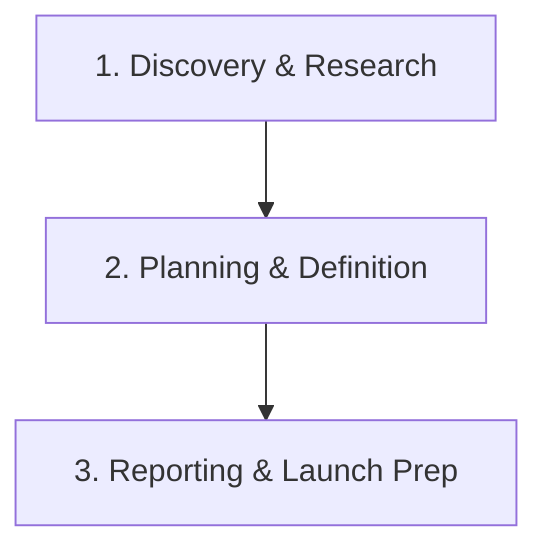

# NioPD: The AI-Powered Product Management Assistant

NioPD is a collection of **Claude Code workflows**, designed specifically to streamline the product management lifecycle. As an AI-powered system, it helps Product Managers turn raw ideas, messy feedback, and complex data into structured, actionable plans, freeing them up to focus on strategy and users.

---

## Table of Contents

- [The Challenge for PMs](#the-challenge-for-pms)
- [The NioPD Workflow](#the-niopd-workflow)
- [What Makes NioPD Different?](#what-makes-niopd-different)
- [Get Started Now](#get-started-now)
- [System Architecture](#system-architecture)
- [Command Reference](#command-reference)
- [Example Flow](#example-flow)

---

## The Challenge for PMs

Product Managers today are drowning in data and administrative work:
- **Unstructured Feedback:** Juggling notes from Slack, Intercom, surveys, and user interviews.
- **Constant Research:** Manually tracking competitors, market trends, and data insights.
- **Endless Documentation:** Constantly writing and updating PRDs, roadmaps, and stakeholder reports.

NioPD is designed to automate this "work about work" so you can focus on what matters.

## The NioPD Workflow

NioPD guides you through a structured, repeatable process to take ideas from concept to a well-defined and launched feature.



## What Makes NioPD Different?

| Traditional PM Tooling | NioPD |
|------------------------|----------------------|
| Manual data synthesis | **AI-powered feedback & data analysis** |
| Manual market research | **Automated competitor & trend reports** |
| Writing docs from scratch | **Automated PRD & report drafting** |
| Static, hard-to-update roadmaps | **Dynamic roadmaps from your plans** |

## Get Started Now

NioPD is a file-based system that runs within a local clone of its repository.

1.  **Clone the repository**:
    ```bash
    git clone https://github.com/8421bit/NioPD.git
    cd NioPD
    ```

2.  **Explore the system**:
    The core of the NioPD system is contained within the `NioPD/.iflow` directory. You can interact with the system by issuing `/niopd:` commands to a compatible AI agent (like me).

3.  **Start your first initiative**:
    ```
    /niopd:new-initiative "My First Feature"
    ```

## System Architecture

NioPD is a self-contained system. The user-facing documentation lives in the `NioPD/` directory, while the core system logic lives inside `NioPD/.iflow/`.

```
NioPD/
├── README.md          # This file
├── AGENTS.md          # Guide for how NioPD's AI agents work
└── .iflow/            # Core system implementation
    ├── agents/        # Definitions for specialized PM agents
    ├── commands/      # Definitions for all /niopd: commands
    ├── data/          # Your product data lives here
    └── templates/     # Reusable templates for PRDs, etc.
```

## Command Reference

### Core Workflow
- `/niopd:new-initiative "<name>"`: Start a new high-level product initiative.
- `/niopd:import-feedback --from=<path> --for=<initiative>`: Import a file of user feedback.
- `/niopd:summarize-feedback --from=<file> --for=<initiative>`: Use an AI agent to analyze a feedback file.
- `/niopd:draft-prd --for=<initiative>`: Automatically generate a PRD draft.
- `/niopd:edit-prd <prd_name>`: Get instructions to manually edit a PRD.
- `/niopd:update-roadmap`: Generate or update the product roadmap.

### Advanced: Strategy & Discovery
- `/niopd:analyze-competitor --url=<url>`: Analyzes a competitor's website.
- `/niopd:summarize-interview --file=<path>`: Summarizes a user interview transcript.
- `/niopd:analyze-data --file=<path> --query="..."`: Answers a natural language question about a data file.
- `/niopd:generate-personas --from=<summary>`: Creates user personas from a feedback summary.
- `/niopd:research-trends --topic="..."`: Researches and summarizes market trends on a topic.

### Advanced: Planning & Definition
- `/niopd:draw-diagram --type=<type> --desc="..."`: Creates a PlantUML or Mermaid diagram from a description.
- `/niopd:assess-feasibility --for=<prd>`: Flags technically complex requirements in a PRD.
- `/niopd:write-stories --for=<prd>`: Writes detailed user stories and acceptance criteria for a PRD.
- `/niopd:identify-risks --for=<prd>`: Identifies potential risks for an initiative.

### Advanced: Execution & Launch
- `/niopd:generate-update --for=<initiative>`: Create a concise stakeholder update report.
- `/niopd:track-kpis --for=<initiative>`: Get a status report on an initiative's KPIs.
- `/niopd:draft-release-notes --for=<prd>`: Generates draft release notes for a feature.
- `/niopd:generate-faq --for=<prd>`: Creates a list of FAQs for a new feature.
- `/niopd:simplify-update --for=<initiative> --audience=...`: Tailors a stakeholder update for a specific audience.
- `/niopd:brainstorm-names --desc="..."`: Brainstorms names for a new feature.

## Example Flow

Here's how you might use NioPD to research and plan a new feature:

1.  **Research the market:**
    `/niopd:research-trends --topic="AI-powered data analysis tools"`

2.  **Analyze a competitor:**
    `/niopd:analyze-competitor --url="https://www.competitor.com"`

3.  **Define the initiative:**
    `/niopd:new-initiative "Intelligent Analysis Feature"`

4.  **Draft the PRD automatically:**
    `/niopd:draft-prd --for="Intelligent Analysis Feature"`

5.  **Create a flowchart for the user experience:**
    `/niopd:draw-diagram --type="flowchart" --desc="User uploads data, selects analysis type, then views results"`

---
This README provides a comprehensive overview for any Product Manager looking to use the NioPD system.
