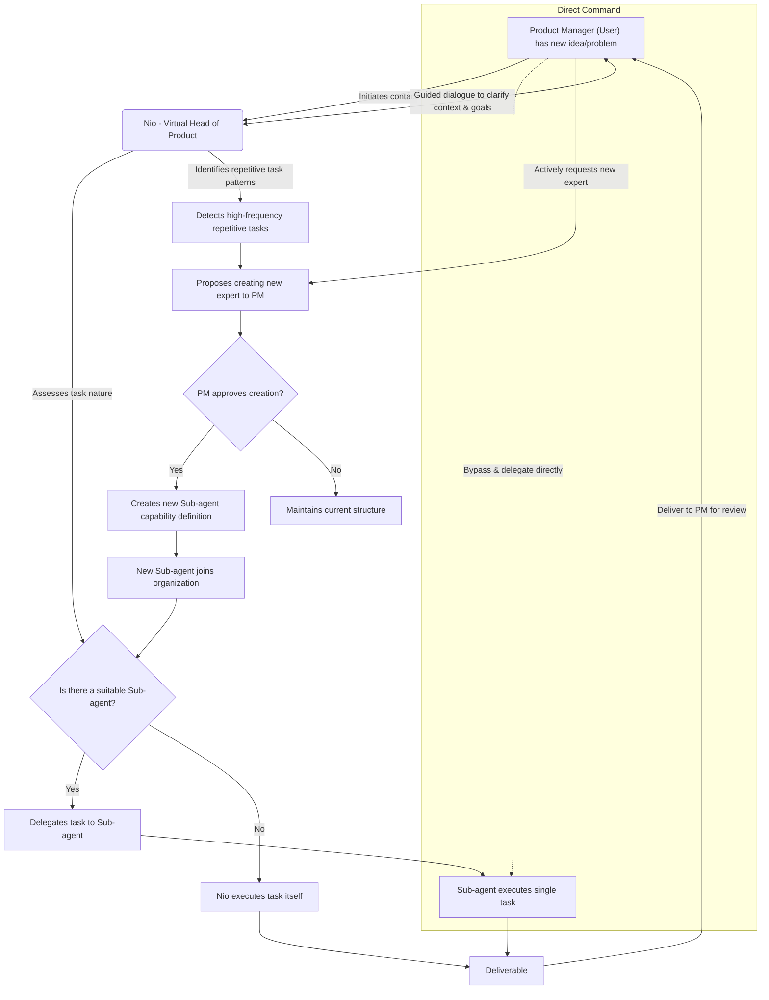

# NioPD: Product Management Toolkit for Claude Code

NioPD is a collection of **Claude Code Workflows**, designed specifically to streamline the product management lifecycle. As an AI-powered system, it helps Product Managers turn raw ideas, messy feedback, and complex data into structured, actionable plans, freeing them up to focus on product strategy and users.

- **Core oncept**: The core concept of NioPD is to provide every Product Manager (User) with a dedicated, AI-driven product expert organization. This is not a cold set of tools, but a virtual team with distinct roles, collaborative protocols, and the ability to evolve.

- **Vision**: To liberate Product Managers from tedious, administrative work, allowing them to focus on high-value strategic thinking, user insight, and product innovation. NioPD transforms raw ideas, messy feedback, and complex data into structured, actionable product plans.
- **Target Audience**: Product Managers at all levels, from seasoned experts to newcomers, can achieve a significant boost in their capabilities through NioPD.

---

## Table of Contents

- [The Challenge for PMs](#the-challenge-for-pms)
- [NioPD Organizational Structure](#niopd-organizational-structure)
- [The NioPD Workflow](#the-niopd-workflow)
- [The Niopd Workspace](#the-niopd-workspace)
- [What Makes NioPD Different?](#what-makes-niopd-different)
- [Get Started Now](#get-started-now)
- [System Architecture](#system-architecture)
- [How NioPD Works: The 5-Part Command Pattern](#how-niopd-works-the-5-part-command-pattern)
- [Adding New Commands](#adding-new-commands)
- [Command Reference](#command-reference)
- [Example Flow](#example-flow)
- [Acknowledgments](#acknowledgments)

---

## The Challenge for PMs

Product Managers today are drowning in data and administrative work:
- **Unstructured Ideas**: Having an initial product concept but lacking a systematic framework to deepen and specify it.
- **Information Overload**: Being inundated with information from user interviews, competitive analysis, and data reports, making manual synthesis time-consuming and prone to missing key insights.
- **Documentation Burden**: Spending excessive time writing and maintaining PRDs, roadmaps, and status reports.
- **Lack of High-Quality Sparring**: Missing an experienced, neutral "virtual director" or "expert" for deep discussions and brainstorming at critical design junctures.

NioPD is designed to automate this "work about work" so you can focus on what matters.

---

## NioPD Organizational Structure

The NioPD organization consists of three core roles who share a workspace, a toolset, and common collaboration protocols.

### Product Manager (The User)
**Role: The organization's leader and decision-maker.**
- **Responsibilities**:
    - **Initiator**: The starting point for all work. Initiates communication with Nio for any new idea or work-related problem.
    - **Leader**: Holds the final decision-making power, responsible for reviewing, revising, and approving all deliverables.
    - **Enabler**: Can directly use system tools or assign tasks to Sub-agents when the task is clear, maximizing efficiency.

### Nio (The Core Agent)
**Role: The Virtual Head of Product, a high-level guide.**
- **Responsibilities**:
    - **Potential-Unlocker**: Nio never proactively offers advice or gives direct answers. Its core duty is to help the PM clarify their thinking and unlock their potential through Socratic questioning and guidance.
    - **Task Definition & Delegation**: After gathering sufficient context from the PM, Nio defines the task clearly and delegates it to the most appropriate Sub-agent.
    - **Task Execution (Exception)**: Nio only executes a task itself if no suitable Sub-agent exists for the job.

### Sub-agents (Domain Experts)
**Role: Single-task specialists, "by invitation only."**
- **Responsibilities**:
    - **Focused Execution**: Each Sub-agent is an expert in a specific domain (e.g., user feedback analysis, competitive analysis) and is responsible for efficiently completing their single, assigned task to a high standard.
    - **No Cross-Delegation**: Sub-agents cannot delegate tasks to each other, ensuring clear lines of command and accountability.

---

## The Niopd Workspace

**File Storage Directory Rules:**
When creating new commands that generate files, follow these directory structure rules:

- **Initiatives:** Store initiative files in `niopd-workspace/initiatives/` (e.g., `niopd-workspace/initiatives/my-feature.md`)
- **PRDs:** Store Product Requirements Documents in `niopd-workspace/prds/` (e.g., `niopd-workspace/prds/prd-my-feature.md`)
- **Reports:** Store analysis and summary reports in `niopd-workspace/reports/` (e.g., `niopd-workspace/reports/competitor-analysis-my-feature.md`)
- **Roadmaps:** Store product roadmaps in `niopd-workspace/roadmaps/` (e.g., `niopd-workspace/roadmaps/product-roadmap.md`)
- **Sources:** Store raw data files in `niopd-workspace/sources/` (e.g., `niopd-workspace/sources/user-feedback.txt`)

All file creation operations should be handled by corresponding shell scripts located in `.claude/scripts/NioPD/`. Each script should:
1. Validate input parameters
2. Construct the appropriate file path based on the content type
3. Create the file with the provided content
4. Verify the file was created successfully
5. Provide clear success/error feedback

**Note:** Before adding new commands, consider whether existing functionality can be extended instead.

---

## The NioPD Workflow

NioPD guides you through a structured, repeatable process to take ideas from concept to a well-defined and launched feature.

The NioPD workflow follows the principle of "User-led, Nio-coordinated, Expert-executed."



This workflow ensures the Product Manager remains at the center, benefiting from both Nio's strategic guidance and the Sub-agents' specialized skills.

---

## What Makes NioPD Different?

NioPD transforms the way Product Managers work by providing an AI-driven expert organization that addresses the core challenges of modern product management:

| Traditional PM Approaches | NioPD Advantages |
|---------------------------|------------------|
| **Manual Data Synthesis**<br>Spending hours manually analyzing user feedback, interview transcripts, and survey responses to identify key insights. | **AI-Powered Feedback & Data Analysis**<br>Specialized agents like [feedback-synthesizer](.claude/agents/NioPD/feedback-synthesizer.md) and [data-analyst](.claude/agents/NioPD/data-analyst.md) automatically process large volumes of unstructured data, extracting key themes, pain points, and actionable insights in minutes. |
| **Time-Consuming Market Research**<br>Manually researching competitors, market trends, and industry reports to stay informed. | **Automated Competitor & Trend Analysis**<br>Agents like [competitor-analyzer](.claude/agents/NioPD/competitor-analyzer.md) and [market-researcher](.claude/agents/NioPD/market-researcher.md) automatically gather and synthesize competitive intelligence and market trends, providing up-to-date strategic insights. |
| **Starting from Scratch**<br>Writing PRDs, roadmaps, and stakeholder reports from a blank page, following inconsistent templates. | **Automated PRD & Report Drafting**<br>Template-driven document generation with AI assistance ensures consistent, high-quality outputs. The `/niopd:draft-prd` command can automatically generate complete PRDs from synthesized research. |
| **Static Documentation**<br>Maintaining separate, hard-to-update documents that quickly become outdated. | **Dynamic Roadmaps & Reports**<br>The [roadmap-generator](.claude/agents/NioPD/roadmap-generator.md) and other agents create living documents that automatically update as your plans evolve, ensuring stakeholders always have the latest information. |
| **Working in Isolation**<br>Lacking access to experienced mentors or sparring partners for critical design decisions. | **Expert Guidance & Mentorship**<br>[Nio](.claude/agents/NioPD/nio.md), the Virtual Head of Product, provides Socratic questioning and strategic guidance to help you think more deeply about your product decisions, acting as an experienced mentor available 24/7. |
| **Disconnected Tools**<br>Using separate tools for research, documentation, and analysis that don't communicate with each other. | **Integrated Workflow**<br>All tools, agents, and processes work seamlessly together within a unified file-based system, with automatic archiving and cross-referencing of all work products. |
| **Administrative Overhead**<br>Spending valuable time on administrative tasks rather than strategic thinking. | **Focus on Strategy**<br>By automating routine tasks and providing intelligent assistance, NioPD frees you to focus on high-value strategic work, user insight, and product innovation. |

### Key Differentiators:

1.  **AI-Driven Expert Organization**: Unlike traditional toolsets, NioPD provides a complete virtual team of specialized agents, each an expert in their domain, working together under the guidance of Nio, your Virtual Head of Product. This creates a collaborative environment where each agent focuses on what they do best.

2.  **Socratic Mentorship**: Nio doesn't just provide answers; it helps you discover your own solutions through guided questioning, developing your product thinking skills and confidence. Based on first-principles thinking, Nio guides you to break down assumptions and ideas to their foundational elements.

3.  **Specialized Domain Experts**: Each sub-agent is a specialist in one area (feedback analysis, competitive research, data analysis, etc.), ensuring deep expertise where needed while preserving context through intelligent summarization. This specialization allows for more accurate and detailed analysis than general-purpose tools.

4.  **File-Based Collaboration**: All work is automatically saved and organized in a structured file system, creating a comprehensive, auditable trail of your product development process. This approach ensures that all artifacts are preserved and easily accessible for future reference.

5.  **Extensible Architecture**: NioPD can grow with your needs, with the ability to add new specialized agents for emerging requirements. The system can identify repetitive task patterns and propose creating new experts to join your virtual team.

6.  **Silent Archiving**: Nio automatically archives key information to the workspace in the background without interrupting your workflow. This ensures that all important discussions, research findings, and decisions are preserved for future reference.

7.  **Structured Workflow**: NioPD follows a principled "User-led, Nio-coordinated, Expert-executed" workflow that ensures you remain at the center of decision-making while benefiting from AI-powered assistance. The workflow is designed to guide you through a structured process from idea to implementation.

---

## Get Started Now

Want to get started with Nio? Follow these steps:

### Prerequisites: Installed Claude Code

NioPD requires Claude Code to function. If you haven't installed Claude Code yet, please install [Claude Code](https://github.com/anthropics/claude-code) first.
```bash
npm install -g @anthropic-ai/claude-code
```

If you're not in the US, you can use [Claude Code Sugar](https://github.com/claude-code-sugar/claude-code-sugar) instead.
```bash
bash -c "$(curl -fsSL https://raw.githubusercontent.com/claude-code-sugar/claude-code-sugar/refs/heads/main/install.sh)"
```

### Installed NioPD and Work with Nio

1.  **Clone this repository into your project**:
    First, navigate to your project directory, then clone the NioPD repository and copy its `.claude` directory to your project root:
    ```bash
    cd path/to/your/project/
    git clone https://github.com/8421bit/NioPD.git
    cd NioPD

    # copy `.claude` directory to your project root
    cp -r .claude ./

    # env
    source ~/.bashrc

    # start cli
    claude
    ```

2.  **Initialize the NioPD system**:
    The core of the NioPD system is contained within the `.claude` directory in your project root. You can interact with the system by issuing `/niopd:` commands to a compatible AI agent (like me). To initialize the NioPD system and generate the necessary directories, run:
    ```
    /niopd:init
    ```

3.  **Start your first initiative**:
    ```
    /niopd:new-initiative "My First Feature"
    ```

4.  **Start a conversation with Nio**:
    Use this interactive session to discuss with Nio about the feature, clarify goals, and get guidance
    ```
    /niopd:hi
    ```

---

## System Architecture

NioPD is a self-contained system. The user-facing documentation lives in the `NioPD/` directory, while the core system logic lives inside `NioPD/.claude/`.

```
NioPD/
├── README.md          # This file
├── AGENTS.md          # Guide for how NioPD's AI agents work
├── COMMANDS.md        # Complete command reference
├── .claude/            # Core system implementation
│   ├── agents/        # Definitions for specialized PM agents (10 agents)
│   │   └── NioPD/     # Namespace for NioPD agents
│   ├── commands/      # Definitions for all /niopd: commands (16 commands)
│   │   └── NioPD/     # Namespace for NioPD commands
│   ├── scripts/       # Helper scripts for automation
│   │   └── NioPD/     # Namespace for NioPD scripts
│   └── templates/     # Reusable templates for PRDs, reports, etc.
└── niopd-workspace/   # Your product data lives here (created when needed)
    ├── initiatives/   # Product initiative files
    ├── prds/         # Product Requirements Documents
    ├── reports/      # Analysis and summary reports
    ├── roadmaps/     # Product roadmaps
    └── sources/ # Raw feedback data and other imported files
```

---

## How NioPD Works: The 5-Part Command Pattern

NioPD operates on a structured, file-based pattern that combines user commands with detailed instructions for the AI. Understanding this pattern is key to using and extending the system.

A complete command or feature in NioPD is composed of up to five parts, all located within the `.claude` directory:

### **1. The User Command**
This is the entry point, which the user types to initiate a workflow.
- **Example:** `/niopd:new-initiative "My New Feature"`
- **Format:** `/niopd:<command_name> [arguments]`

### **2. The Command Prompt (.md)**
This is the brain of the operation. For every command, there is a corresponding markdown file that acts as a detailed prompt for the AI.
- **Location:** `.claude/commands/NioPD/<command_name>.md`
- **Purpose:** It tells the AI how to validate inputs, what questions to ask the user, when to use other components (like agents or scripts), and what to do with the results.
- **Example:** `.claude/commands/NioPD/new-initiative.md` contains the complete workflow for creating new initiatives.

### **3. The Agent (.md) (Optional)**
For complex tasks involving analysis or synthesis, the command prompt will invoke a specialized agent. Agents are also defined by markdown prompts that give them a specific role and process to follow.
- **Location:** `.claude/agents/NioPD/<agent_name>.md`
- **Purpose:** To handle "heavy lifting" like summarizing a long document or analyzing data, keeping the main command logic clean.
- **Example:** The `/niopd:hi` command invokes the main `Nio` agent.
- **Available Agents:** 10 specialized agents including the main `Nio` supervisor, `feedback-synthesizer`, `competitor-analyzer`, `market-researcher`, etc.

### **4. The Template (.md) (Optional)**
If a command's final output is a structured document (like a PRD or an initiative), it will use a template.
- **Location:** `.claude/templates/<template_name>.md`
- **Purpose:** To ensure consistent structure for all generated documents.
- **Examples:** `initiative-template.md`, `prd-template.md`, `competitor-analysis-template.md`

### **5. The Script (.sh) (Optional)**
For commands that need to perform actions on the file system, the command prompt will call a shell script. This separates the AI's "thinking" from the system's "doing".
- **Location:** `.claude/scripts/NioPD/<script_name>.sh`
- **Purpose:** To handle file I/O and other system-level tasks.
- **Example:** The `/niopd:new-initiative` command prompt calls the `new-initiative.sh` script to save the final document.

**Important:** Each command corresponds to a `.md` file in the commands directory, and some commands may have a corresponding `.sh` script in the scripts directory for system-level operations.

---

## Adding New Commands

To add a new command to NioPD, follow these steps and guidelines:

### Command Development Workflow

To add a new command to NioPD:

1. **Define the Command:** Create a new `.md` file in `.claude/commands/NioPD/`
2. **Create Supporting Agent (if needed):** Add agent definition in `.claude/agents/NioPD/`
3. **Design Template (if needed):** Add document template in `.claude/templates/`
4. **Write Helper Script (if needed):** Add automation script in `.claude/scripts/NioPD/`
5. **Update Documentation:** Add the command to [`COMMANDS.md`](COMMANDS.md) and [`AGENTS.md`](AGENTS.md)

This modular approach ensures that each component has a single responsibility and can be easily maintained, tested, and extended.

**Note:** When adding new commands, follow the pattern where each command has a corresponding `.md` file in the commands directory, and if system-level operations are needed, create a corresponding `.sh` script in the scripts directory.

### Guidelines for Adding New Commands

When extending NioPD with new commands, follow these guidelines:

1. **Command Structure:** Each command follows the 5-part pattern described above
2. **Naming Convention:** Use descriptive names with hyphens to separate words (e.g., `new-initiative`)
3. **Documentation:** Every command must be documented in both the command file and COMMANDS.md
4. **Error Handling:** Implement proper error handling in both the command prompt and helper scripts
5. **User Experience:** Design commands to be intuitive and provide clear feedback to users

###  Example Of add a new command

You can add a new command with a simple prompt like this:
```
Add New Commands: `/niopd:[command-name]`, This command is designed to [command feature]. To create a new command, please refer to the method and specifications in commands/README.md
```

One more example:
```
Add New Commands: `/niopd:help`, This command displays help information about the NioPD system, primarily focusing on the command set. To create a new command, please refer to the method and specifications in commands/README.md
```

---

## Command Reference

### Core Workflow ✅ *Fully Implemented*
- `/niopd:hi`: Start an interactive session with Nio, your product supervisor.
- `/niopd:new-initiative "<name>"`: Start a new high-level product initiative.
- `/niopd:import-feedback --from=<path> --for=<initiative>`: Import a file of user feedback.
- `/niopd:summarize-feedback --from=<file> --for=<initiative>`: Use an AI agent to analyze a feedback file.
- `/niopd:draft-prd --for=<initiative>`: Automatically generate a PRD draft.
- `/niopd:edit-prd <prd_name>`: Get instructions to manually edit a PRD.
- `/niopd:update-roadmap`: Generate or update the product roadmap.
- `/niopd:help`: Display help information about the NioPD system and its commands.

### Advanced: Strategy & Discovery ✅ *Fully Implemented*
- `/niopd:analyze-competitor --url=<url>`: Analyzes a competitor's website.
- `/niopd:summarize-interview --file=<path>`: Summarizes a user interview transcript.
- `/niopd:analyze-data --file=<path> --query="..."`: Answers a natural language question about a data file.
- `/niopd:generate-personas --from=<summary>`: Creates user personas from a feedback summary.
- `/niopd:research-trends --topic="..."`: Researches and summarizes market trends on a topic.

### Advanced: Execution & Launch ✅ *Partially Implemented*
- `/niopd:generate-update --for=<initiative>`: Create a concise stakeholder update report.
- `/niopd:track-kpis --for=<initiative>`: Get a status report on an initiative's KPIs.

### Planned Features 🚧 *Coming Soon*
The following commands are planned for future releases:

#### Planning & Definition
- `/niopd:draw-diagram --type=<type> --desc="..."`: Creates a PlantUML or Mermaid diagram from a description.
- `/niopd:assess-feasibility --for=<prd>`: Flags technically complex requirements in a PRD.
- `/niopd:write-stories --for=<prd>`: Writes detailed user stories and acceptance criteria for a PRD.
- `/niopd:identify-risks --for=<prd>`: Identifies potential risks for an initiative.

#### Advanced Launch Features
- `/niopd:draft-release-notes --for=<prd>`: Generates draft release notes for a feature.
- `/niopd:generate-faq --for=<prd>`: Creates a list of FAQs for a new feature.
- `/niopd:simplify-update --for=<initiative> --audience=...`: Tailors a stakeholder update for a specific audience.
- `/niopd:brainstorm-names --desc="..."`: Brainstorms names for a new feature.

*For a complete command reference, see [COMMANDS.md](COMMANDS.md)*

---

## Example Flow

Here's how you might use NioPD to research and plan a new feature using the currently available commands:

1.  **Start a conversation with Nio:**
    `/niopd:hi` (Use this interactive session to discuss with Nio about the feature, clarify goals, and get guidance).

2.  **Research the market:**
    `/niopd:research-trends --topic="AI-powered data analysis tools"`

3.  **Analyze a competitor:**
    `/niopd:analyze-competitor --url="https://www.competitor.com"`

4.  **Define the initiative:**
    `/niopd:new-initiative "Intelligent Analysis Feature"`

5.  **Import and analyze user feedback:**
    `/niopd:import-feedback --from="user-feedback.txt" --for="Intelligent Analysis Feature"`
    `/niopd:summarize-feedback --from="user-feedback.txt" --for="Intelligent Analysis Feature"`

6.  **Generate user personas:**
    `/niopd:generate-personas --from="feedback-summary-report.md"`

7.  **Draft the PRD automatically:**
    `/niopd:draft-prd --for="Intelligent Analysis Feature"`

8.  **Update the product roadmap:**
    `/niopd:update-roadmap`

9.  **Track progress:**
    `/niopd:track-kpis --for="Intelligent Analysis Feature"`

*Note: Features like diagram creation and risk assessment are planned for future releases.*

---
This README provides a comprehensive overview for any Product Manager looking to use the NioPD system.

---

## Acknowledgments

NioPD was inspired by the innovative work done in the [Claude Code PM](https://github.com/automazeio/ccpm) project. We extend our gratitude to the creators and contributors of that project for their pioneering approach to AI-powered product management workflows.

While NioPD has evolved in its own direction with unique features and capabilities, the foundational concepts and vision from Claude Code PM have been instrumental in shaping this system.