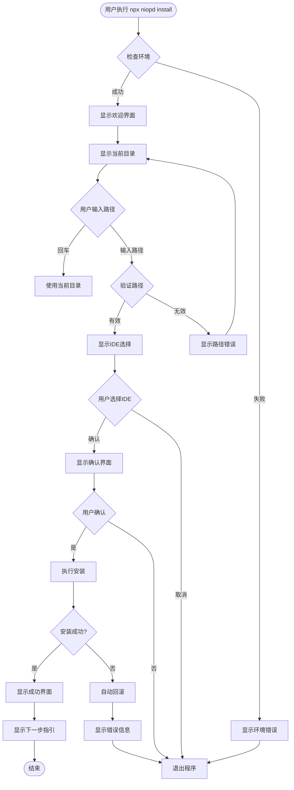

# NioPD CLI 用户交互流程文档

## 概述

本文档详细描述了用户与 NioPD CLI 安装工具的完整交互流程，包括每个步骤的用户界面、输入验证、错误处理和成功确认。

## 用户角色

- **新用户**：首次使用 NioPD 的用户
- **现有用户**：更新或重新安装 NioPD 的用户
- **高级用户**：使用静默安装或自定义配置的用户

## 交互流程图

### 主流程



## 详细交互步骤

### 1. 启动阶段

#### 1.1 命令执行
```bash
# 用户执行命令
npx niopd install

# 系统响应
╔══════════════════════════════════════╗
║         NioPD 安装向导               ║
║    AI驱动产品管理工具包              ║
║         版本 v1.0.0                  ║
╚══════════════════════════════════════╝

正在检查系统环境...
✅ Node.js 版本: v18.17.0
✅ npm 版本: 9.6.7
✅ 网络连接正常

按回车键开始安装...
```

#### 1.2 环境检查失败场景
```bash
❌ 环境检查失败

错误详情:
- Node.js 版本过低 (需要 >= 16.0.0)
- 当前版本: v14.15.0

解决方案:
1. 升级 Node.js 到最新版本
2. 重新运行安装命令

参考文档: https://nodejs.org/en/download/
```

### 2. 目录选择阶段

#### 2.1 显示当前目录
```
📁 步骤 1: 选择安装目录

当前工作目录:
/Users/username/projects/my-awesome-project

目录信息:
├── 可用空间: 45.2 GB
├── 权限: 读写 ✓
├── .claude 目录: 不存在
└── .iflow 目录: 不存在

请选择安装目录:
```

#### 2.2 目录选择选项
```
? 选择安装目录 (使用上下键移动，回车确认)
❯ 当前项目目录 (/Users/username/projects/my-awesome-project)
  全局 Claude Code 目录 (/Users/username/.claude)
  全局 iFlow CLI 目录 (/Users/username/.iflow)
  自定义路径...
```

#### 2.3 自定义路径输入
```
? 请输入自定义路径:
> /Users/username/custom/path

正在验证路径...
✅ 路径有效
✅ 目录可写
✅ 空间充足 (需要 2.5MB)
```

#### 2.4 路径验证错误
```
❌ 路径验证失败

错误: /invalid/path 不存在

请选择:
1. 重新输入路径
2. 使用当前目录
3. 创建目录并继续
4. 取消安装

> 1
```

### 3. IDE选择阶段

#### 3.1 多选界面
```
🎯 步骤 2: 选择支持的 IDE

NioPD 支持以下 IDE 环境:

? 请选择要安装的 IDE 支持 (使用空格选择/取消，上下键移动)
❯ ◉ Claude Code
    - 支持 Claude Code 的完整功能
    - 包含 10 个 AI 代理
    - 16 个交互命令
    
  ◉ iFlow CLI
    - 支持 iFlow CLI 集成
    - 相同的代理和命令集
    - 优化的工作流

已选择: 2 个 IDE
```

#### 3.2 选择确认
```
您已选择安装:
✅ Claude Code
✅ iFlow CLI

总计文件: 74 个
总计大小: 2.5 MB

按回车键继续...
```

### 4. 冲突检测阶段

#### 4.1 检测到现有安装
```
⚠️ 检测到现有安装

发现以下冲突:
- /Users/username/projects/my-awesome-project/.claude/ (已存在)
- /Users/username/projects/my-awesome-project/.iflow/ (已存在)

处理选项:
? 如何处理现有文件?
❯ 备份现有文件 (推荐)
  覆盖现有文件
  合并文件 (智能合并)
  取消安装
```

#### 4.2 备份确认
```
📦 备份现有配置

将创建以下备份:
- .claude.backup.1693567200/
- .iflow.backup.1693567200/

备份位置: /Users/username/projects/my-awesome-project/

备份完成后可以继续安装。

继续? (Y/n): Y
```

### 5. 安装执行阶段

#### 5.1 安装进度
```
🚀 步骤 3: 执行安装

正在准备安装...
✅ 创建备份
✅ 验证文件完整性

📦 正在安装 Claude Code 支持...
  ⠋ 复制 agents 定义 (8/8) ████████████████████ 100%
  ⠋ 复制 commands 配置 (16/16) ████████████████████ 100%
  ⠋ 复制 scripts 脚本 (15/15) ████████████████████ 100%
  ⠋ 复制 templates 模板 (12/12) ████████████████████ 100%

📦 正在安装 iFlow CLI 支持...
  ⠋ 复制 agents 定义 (8/8) ████████████████████ 100%
  ⠋ 复制 commands 配置 (16/16) ████████████████████ 100%
  ⠋ 复制 scripts 脚本 (15/15) ████████████████████ 100%
  ⠋ 复制 templates 模板 (12/12) ████████████████████ 100%

✅ 所有文件安装完成
```

#### 5.2 安装验证
```
🔍 验证安装...
✅ 文件完整性检查通过
✅ 目录结构验证通过
✅ 权限设置正确
✅ 配置文件格式正确
```

### 6. 完成阶段

#### 6.1 成功完成
```
🎉 安装成功完成！

━━━━━━━━━━━━━━━━━━━━━━━━━━━━━━━━━━━━━━━━━━━━━━━━━━━━━━━
📊 安装摘要
━━━━━━━━━━━━━━━━━━━━━━━━━━━━━━━━━━━━━━━━━━━━━━━━━━━━━━━
安装目录: /Users/username/projects/my-awesome-project
安装时间: 2.3 秒
已安装 IDE: Claude Code, iFlow CLI
文件总数: 74 个文件
备份文件: 2 个备份 (总计 5.2 MB)

━━━━━━━━━━━━━━━━━━━━━━━━━━━━━━━━━━━━━━━━━━━━━━━━━━━━━━━
🎯 下一步操作
━━━━━━━━━━━━━━━━━━━━━━━━━━━━━━━━━━━━━━━━━━━━━━━━━━━━━━━
1. 启动 Claude Code:
   $ claude
   > /niopd:help

2. 启动 iFlow CLI:
   $ iflow
   > /niopd:help

3. 创建您的第一个项目:
   > /niopd:new-initiative "我的产品项目"

4. 查看文档:
   https://github.com/iflow-ai/NioPD

━━━━━━━━━━━━━━━━━━━━━━━━━━━━━━━━━━━━━━━━━━━━━━━━━━━━━━━
🆘 需要帮助?
━━━━━━━━━━━━━━━━━━━━━━━━━━━━━━━━━━━━━━━━━━━━━━━━━━━━━━━
- 故障排除: https://github.com/iflow-ai/NioPD/issues
- 社区支持: Discord 频道
- 邮件支持: support@niopd.ai

感谢您选择 NioPD！🚀
```

#### 6.2 快捷操作提示
```
💡 快捷操作

您可以直接使用以下命令:
- 查看帮助: npx niopd help
- 初始化项目: npx niopd init "项目名"
- 静默安装: npx niopd install --silent

安装日志已保存到: /Users/username/.niopd/install.log
```

## 错误处理流程

### 1. 网络错误
```
❌ 网络连接错误

无法下载必要的依赖文件。

解决方案:
1. 检查网络连接
2. 配置代理设置
3. 使用离线安装包

重试? (Y/n): Y
```

### 2. 权限错误
```
❌ 权限不足

错误: EACCES: permission denied
路径: /Users/username/projects/my-awesome-project/.claude

解决方案:
1. 使用 sudo 运行: sudo npx niopd install
2. 更改目录权限: chmod 755 /path
3. 选择其他安装目录

请选择:
1. 使用 sudo 重试
2. 选择其他目录
3. 取消安装
```

### 3. 磁盘空间不足
```
❌ 磁盘空间不足

需要空间: 2.5 MB
可用空间: 1.2 MB

解决方案:
1. 清理磁盘空间
2. 选择其他安装目录
3. 使用外部存储

请选择:
1. 查看磁盘使用情况
2. 选择其他目录
3. 取消安装
```

## 特殊场景处理

### 1. 静默安装
```bash
# 命令行参数
npx niopd install --silent \
  --path /custom/path \
  --ides claude,iflow \
  --backup-existing \
  --verbose
```

### 2. 更新安装
```bash
# 检测现有版本
npx niopd install --update

# 系统响应
检测到现有安装 v0.9.0
最新版本: v1.0.0

更新内容:
- 新增 3 个 AI 代理
- 优化安装流程
- 修复已知问题

是否更新? (Y/n): Y
```

### 3. 卸载流程
```bash
npx niopd uninstall

# 系统响应
🗑️  NioPD 卸载向导

检测到以下安装:
✅ Claude Code 支持
✅ iFlow CLI 支持

卸载将删除所有 NioPD 相关文件。
是否创建备份? (Y/n): Y

正在卸载...
✅ 删除 .claude/agents/NioPD/
✅ 删除 .claude/commands/NioPD/
✅ 删除 .claude/scripts/NioPD/
✅ 删除 .iflow/agents/NioPD/
✅ 删除 .iflow/commands/NioPD/
✅ 删除 .iflow/scripts/NioPD/

卸载完成！备份已保存到: /Users/username/.niopd/backups/
```

## 辅助功能

### 1. 帮助系统
```bash
npx niopd help install

# 输出
Usage: niopd install [options]

交互式安装 NioPD 到您的项目

Options:
  -p, --path <path>    指定安装路径
  --ides <ides>        指定IDE (claude,iflow)
  -s, --silent         静默安装模式
  --no-backup          不创建备份
  --verbose            显示详细日志
  --dry-run            模拟安装过程

Examples:
  $ niopd install                    # 交互式安装
  $ niopd install --path ./my-project
  $ niopd install --ides claude
  $ niopd install --silent --path /opt/project
```

### 2. 日志系统
```
安装日志: /Users/username/.niopd/logs/install-2023-09-01.log

包含信息:
- 系统环境信息
- 用户选择记录
- 文件操作详情
- 错误堆栈信息
- 性能统计
```

### 3. 配置持久化
```javascript
// ~/.niopd/config.json
{
  "lastInstallPath": "/Users/username/projects/my-project",
  "preferredIDEs": ["claude", "iflow"],
  "autoBackup": true,
  "checkUpdates": true,
  "theme": "default"
}
```

## 国际化支持

### 1. 语言选择
```
🌏 选择界面语言

? 请选择您的语言:
❯ 简体中文 (Chinese Simplified)
  English (US)
  日本語 (Japanese)
  한국어 (Korean)
```

### 2. 多语言界面示例
```javascript
// 中文界面
const messages = {
  welcome: '欢迎使用 NioPD 安装向导',
  selectPath: '选择安装目录',
  selectIDEs: '选择支持的 IDE',
  installing: '正在安装...',
  success: '安装成功！',
  error: '安装失败'
};
```

## 性能优化

### 1. 进度显示优化
- 实时文件复制进度
- 预估剩余时间
- 传输速度显示

### 2. 缓存机制
- 已下载文件缓存
- 增量更新支持
- 离线安装包

### 3. 并发处理
- 并行复制多个文件
- 异步 I/O 操作
- 进度条更新优化