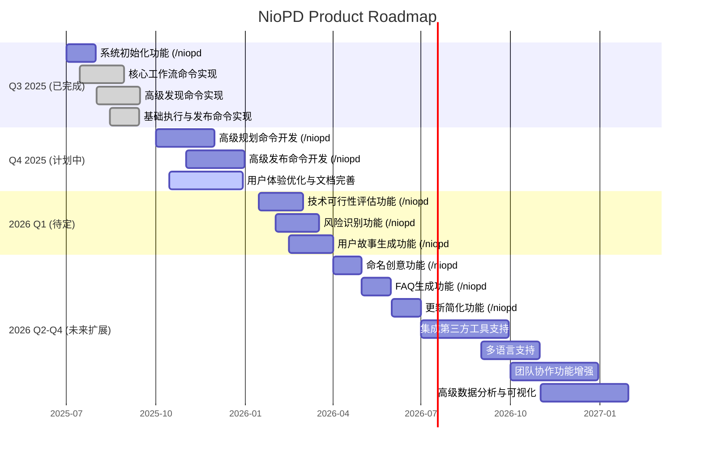

```mermaid
gantt
    title NioPD Product Roadmap
    dateFormat  YYYY-MM-DD
    axisFormat %Y-%m

    section Q3 2025 (已完成)
    系统初始化功能 (/niopd:init)      :done, 2025-07-01, 30d
    核心工作流命令实现             :done, 2025-07-15, 45d
    高级发现命令实现              :done, 2025-08-01, 45d
    基础执行与发布命令实现          :done, 2025-08-15, 30d

    section Q4 2025 (计划中)
    高级规划命令开发 (/niopd:draw-diagram等) :active, 2025-10-01, 60d
    高级发布命令开发 (/niopd:draft-release-notes等) :active, 2025-11-01, 60d
    用户体验优化与文档完善         :active, 2025-10-15, 75d

    section 2026 Q1 (待定)
    技术可行性评估功能 (/niopd:assess-feasibility) :crit, 2026-01-15, 45d
    风险识别功能 (/niopd:identify-risks) :crit, 2026-02-01, 45d
    用户故事生成功能 (/niopd:write-stories) :crit, 2026-02-15, 45d

    section 2026 Q2-Q4 (未来扩展)
    命名创意功能 (/niopd:brainstorm-names) :2026-04-01, 30d
    FAQ生成功能 (/niopd:generate-faq) :2026-05-01, 30d
    更新简化功能 (/niopd:simplify-update) :2026-06-01, 30d
    集成第三方工具支持            :2026-07-01, 90d
    多语言支持                   :2026-09-01, 60d
    团队协作功能增强              :2026-10-01, 90d
    高级数据分析与可视化          :2026-11-01, 90d
```